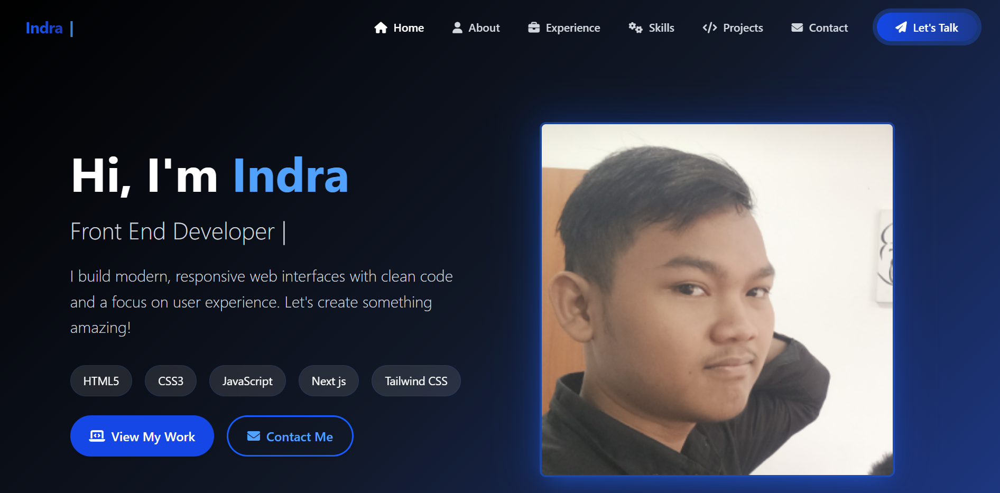

# 📌 Portofolio - Personal Portfolio Website



## 🌟 About Project

This personal portfolio showcases my work, skills, and professional experience. Built with:

- **Framework**: [Alpine.js](https://alpinejs.dev/) for simpel javascript dom and events
- **Styling**: [Tailwind CSS](https://tailwindcss.com/) for utility-first styling
- **Deployment**: [Vercel](https://vercel.app/) for fast and automatic hosting

🔗 **Live Demo**: [portofolio-nine-ashen.vercel.app](https://portofolio-nine-ashen.vercel.app)

## 🚀 Key Features

- ✅ Responsive design (mobile, tablet, desktop)
- ✅ Projects section with category filtering
- ✅ Simpel Design

## 🛠 Local Installation

1. Clone repository:
   ```bash
   git clone https://github.com/MamenHD/Portofolio.git

2. Navigate to project directory:
    ```bash
    cd Portofolio

---

## 🚀 **Thanks for checking out my portfolio!**  

This portfolio represents my digital journey and passion for web development. Every line of code was crafted with ❤️ and plenty of ☕.  

✨ **Let's connect!** I'm always open to:  
- Exciting project collaborations  
- Discussions about cutting-edge tech  
- Work opportunities  

⭐ **If this portfolio inspires you,** feel free to star this repo!  

*"Don't forget to git push"*  